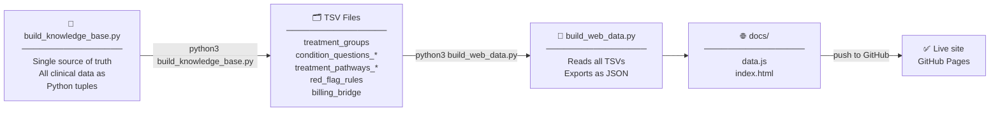

# Dental Clinical Decision Support System
### 牙科临床决策支持系统

> **Live site →** `https://<your-github-username>.github.io/dental-cds/`

An open, evidence-based clinical decision support tool for dental diagnosis and treatment planning. Structured knowledge base covering 32 dental condition groups with bilingual (Chinese/English) web interface, ICD-10 billing mapping, and safety red flags.

---

## Try it

**[→ Open the web tool](https://<your-github-username>.github.io/dental-cds/)**

No installation. Works in any modern browser, online or offline once loaded.

- **Clinical Tool** — select a condition group → answer structured questions → get matched treatment pathways + ICD-10 billing codes + safety red flags
- **Data Browser** — search all 32 groups, inspect every pathway and red flag, filter by domain

---

## For clinicians — how to verify the logic

Every pathway and red flag is fully traceable. Here is how to check any rule.

### Check a treatment pathway

Open the relevant `treatment_pathways_*.tsv` file. Each row has:

| Column | Meaning |
|---|---|
| `pathway_id` | Unique ID, e.g. `TP-07-01` |
| `condition_rule` | Boolean logic that triggers this pathway, e.g. `tooth_type=permanent AND systemic_risk_factors=none` |
| `candidate_treatment_en` | Recommended treatment |
| `treatment_line` | `first_line`, `escalation`, or `red_flag` |
| `source_codes` | Guideline references, e.g. `REF-003\|REF-008` — cross-reference with `REFERENCES.md` |

### Check a red flag

Open `red_flag_rules.tsv`. Each row has the trigger condition, severity (`emergency` / `block` / `caution`), required action, clinical rationale, and source references.

### Check an ICD-10 billing code

Open `billing_bridge.tsv`. Each row maps a pathway + condition filter to a specific ICD-10 code, with disambiguation notes (e.g. `nocturnal_pain=yes → K04.01` acute vs `nocturnal_pain=no → K04.03` chronic).

### Run the query engine

```bash
git clone https://github.com/<username>/dental-cds.git
cd dental-cds
python3 query.py        # runs 7 demo cases covering key scenarios
```

Or import it:

```python
from query import KnowledgeBase
kb = KnowledgeBase()

result = kb.query("TG-07", {
    "tooth_type": "permanent",
    "tooth_restorability": "restorable",
    "systemic_risk_factors": "none",
    "nocturnal_pain": "yes",
})
# → pathway: RCT → crown/core restoration
# → billing: K04.01 (acute pulpitis, nocturnal pain)
# → flags: none
```

Requires Python 3.9+. No external dependencies.

---

## For researchers — knowledge base structure

### Build pipeline



> **TSV files are the auditable layer** — every row has `source_codes` traceable to `REFERENCES.md`. Researchers can verify logic without running any code.

### Files

| File | Contents |
|---|---|
| `build_knowledge_base.py` | **Single source of truth** — all clinical data as Python tuples; run to regenerate all TSV files |
| `build_web_data.py` | Generates `docs/data.js` from TSV files for the web tool |
| `query.py` | Python query engine — evaluates condition rules, returns matched pathways + billing + flags |
| `DATA_DICTIONARY.md` | All 114 clinical dimensions with valid option values and clinical meaning |
| `DESIGN_DECISIONS.md` | Every clinical and structural decision with rationale (v1.7) |
| `REFERENCES.md` | 34 bibliographic references |
| `CLINICAL_REVIEW_QUESTIONS_ROUND2_EN.md` | 8 open questions awaiting expert dentist review |
| `VALIDATION_REPORT_v1.md` | Structural and clinical logic validation report |
| `treatment_groups.tsv` | 42 defined groups (32 implemented) |
| `condition_questions_*.tsv` | 152 clinical intake questions across 6 domain files |
| `treatment_pathways_*.tsv` | 155 treatment pathways across 6 domain files |
| `red_flag_rules.tsv` | 24 safety rules |
| `billing_bridge.tsv` | 123 ICD-10 billing mappings |
| `docs/index.html` | Web app (single-page, bilingual, no build step) |
| `docs/data.js` | All knowledge base data as JSON (auto-generated) |

### Coverage

| Domain | Groups | Pathways | Red flags |
|---|---|---|---|
| Caries | TG-02, TG-03 | 15 | 2 |
| Pulpal | TG-06 – TG-10 | 38 | 10 |
| Periodontal | TG-11 – TG-15 | 26 | 4 |
| Hard Tissue / Wear | TG-16 – TG-18 | 10 | 0 |
| Impaction / Eruption | TG-19 – TG-21 | 10 | 1 |
| Prosthetics / Implants | TG-22 – TG-24 | 8 | 2 |
| Developmental | TG-25, TG-26 | 6 | 1 |
| Malocclusion / TMJ | TG-27 – TG-29 | 9 | 0 |
| Mucosal / Oncology | TG-31 – TG-35 | 25 | 3 |
| Trauma | TG-40 | 8 | 2 |
| **Total** | **32** | **155** | **24** |

### Condition rule syntax

```
tooth_type=permanent              →  answers['tooth_type'] == 'permanent'
systemic_risk_factors!=none       →  answers['systemic_risk_factors'] != 'none'
A AND B                           →  both must be true (AND binds tighter than OR)
A OR B                            →  either must be true
(A OR B) AND C                    →  parentheses group as expected
(empty rule)                      →  unconditional match
```

### How this knowledge base was built

Clinical content was derived through a structured, multi-phase knowledge engineering process:

1. **Guideline extraction** — Key recommendations were extracted from 9 major clinical guidelines (AAE, AAPD, EFCD-ESE-ORCA, EFP, AAOMS, IADT, ADA, NICE, McGill Consensus; full list in `REFERENCES.md`).
2. **Structured encoding** — Recommendations were encoded as explicit condition rules (`dimension=value` logic) rather than free text, making every decision machine-readable and auditable.
3. **Clinical review cycles** — Two rounds of structured review questions were compiled and answered, covering threshold ambiguities, protocol choices, and scope decisions. Open questions are documented in `CLINICAL_REVIEW_QUESTIONS_ROUND2_EN.md`.
4. **Validation** — Each phase was checked for internal consistency (referential integrity across TSV files) and clinical logic (rules traceable to source guidelines). See `VALIDATION_REPORT_v1.md`.
5. **Transparency by design** — All data lives in plain-text TSV files with source codes on every row. Nothing is computed at runtime that cannot be read directly from the files.

The build pipeline is fully reproducible: `build_knowledge_base.py` is the single source of truth; running it regenerates all TSV files from scratch.

### Key design decisions

- **Traceable sources:** Every pathway requires `source_codes` linking to a published guideline. See `DESIGN_DECISIONS.md` for every clinical and structural decision with rationale.
- **Conservative defaults:** Where guidelines conflict, the most conservative option is taken.
- **Billing is a separate layer:** ICD-10 codes are not embedded in pathways — one pathway can map to different codes depending on additional clinical details.
- **Red flags fire independently:** Safety rules evaluate regardless of whether any pathway matches.
- **Explicit escalation:** When a finding exceeds the group's scope, the pathway says `ESCALATE → TG-XX` explicitly.

---

## Pending clinical review (Phase 9)

Eight questions await expert dentist review before implementation. See [`CLINICAL_REVIEW_QUESTIONS_ROUND2_EN.md`](CLINICAL_REVIEW_QUESTIONS_ROUND2_EN.md):

- RQ2-01 HbA1c thresholds for periodontal deferral
- RQ2-02 Antibiotic regimen for TG-09 (periapical abscess)
- RQ2-03 Coronectomy eligibility criteria (TG-20)
- RQ2-04 Smoking and implant protocols (TG-22/24)
- RQ2-05 MIH extraction threshold (TG-26)
- RQ2-06 TMJ/CBT referral threshold (TG-29)
- RQ2-07 Timing of periodontal surgery after SRP (TG-13)
- RQ2-08 Priority for unimplemented groups (TG-01, TG-04/05, TG-30, TG-36–42)

---

## Key references

| Reference | Guideline |
|---|---|
| AAE 2013 | Endodontic diagnosis |
| AAPD 2024 | Vital pulp therapy, primary teeth |
| EFCD-ESE-ORCA S3 2025 | Deep caries management (PMC13102370) |
| EFP S3 2020 | Periodontal treatment |
| AAOMS 2022 | MRONJ prevention and treatment |
| IADT 2020 | Dental trauma guidelines |
| ADA 2019 | Antibiotic stewardship in dentistry |
| NICE NG235 | Impacted wisdom teeth |
| McGill Consensus | Implant overdentures, edentulous mandible |

Full list with DOIs: [`REFERENCES.md`](REFERENCES.md)

---

## Reproduce everything from scratch

```bash
git clone https://github.com/<username>/dental-cds.git
cd dental-cds
python3 build_knowledge_base.py   # regenerates all TSV files
python3 build_web_data.py         # regenerates docs/data.js
open docs/index.html              # open site locally (macOS)
python3 query.py                  # run query engine demo
```

Requires Python 3.9+, no external packages.

---

## ⚠ Clinical use notice

This system is a **decision support aid only**. All treatment decisions must be made by a qualified clinician based on the individual patient's full clinical presentation, radiographs, and history. This tool does not replace clinical examination.

---

## Contributing

- **Pathway errors:** Open an issue with pathway ID, what the rule says, what it should say, and the reference.
- **Missing groups:** TG-01, TG-04, TG-05, TG-30, TG-36–42 are not yet implemented.
- **Clinical review:** If you are a dentist and can answer the Phase 9 questions, open a PR or issue.
